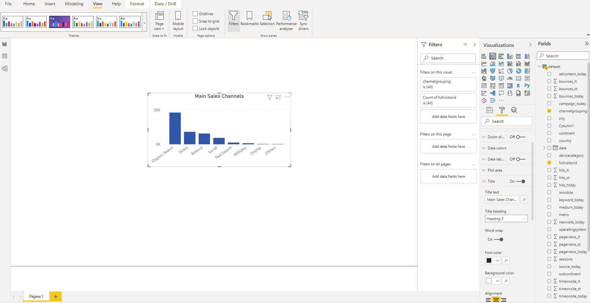

# Mini Project with Power Bi and google Analytics

The purpose of this mini-project is to simulate what it would be like to work with Power BI using data obtained directly from Google Analytics.

## Getting the data

As many do not have an online page from which to extract the data, we will use data from the [Google Merchandise](https://www.googlemerchandisestore.com/) Store available on [Google Cloud](https://cloud.google.com/). To facilitate analysis, the [dataset](./assets/dataset.csv) used for this project can be downloaded directly from the repository.

## Problem Parameters

We are dealing with data from an e-commerce. For this project, we will answer the following questions:

1. How do customers access our portal the most, through organic or paid search?
2. How long on average does a visitor stay on our portal per day of the month?
3. What is the main source of access to our portal?
4. What is the most used operating system to access our portal?
5. What is the most used device to access our portal?
6. What is the total billing per day?

## Uploading the data and setting the enviroment

If your default language is not English (United States), then you will need to go to `Files` &rarr; `Options & Settings` &rarr; `Options` &rarr; `Regional Settings` and change the language to English (United States). Then, you can click on `Get Data` and import the dataset (CVS file). Before loading the data into your project, click on `Transform Data` to make sure everything is correct.

The first two columns are ID keys, so it's good practice to keep the data as `text`. If Power BI recognized these columns as number, then change the type to `text`. The data doesn't seem to have any other kind of inconsistency, so we can click `Close and Apply`.

For the created dashboard, I chose the `Executive` theme, but feel free to choose the theme that suits you best.

## Answering the questions
### Question 1

To answer this question, we will create a bar chart with the main sales channels. To do this, simply select the bar chart and click on the `fullvisitorid` (count) and `channelgrouping` values.

Thus, we can see that customers access the portal mostly via organic search, while paid search shows one of the lowest returns. This could indicate that there is unnecessary ad spend or that the current ad spend is misdirected.

### Question 2

To answer this question, we will use a line graph. Just select the parameters `day (date - hierarchy)` and `timeonsite_st`. Notice that at each step I change the look of the graphs so that they are easier to read.

From this graph, we can see that accesses at the beginning of the month tend to be higher than accesses at the end of the month, reaching their maximum around the 10th. This analysis can help to direct the right moment for promotions and advertisements.

### Question 3

