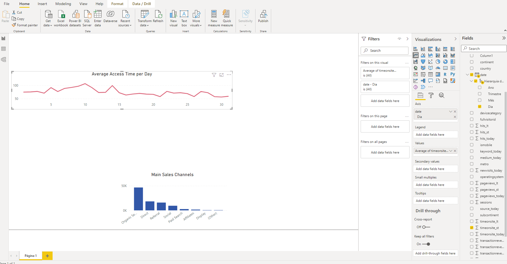
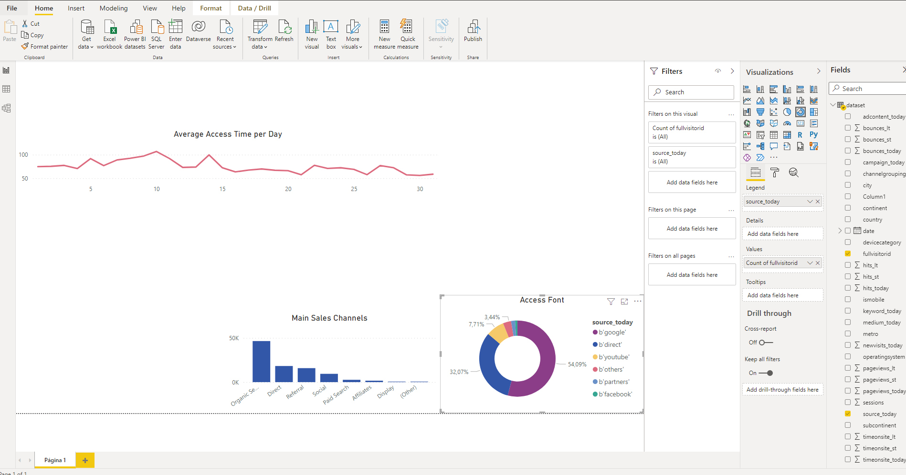
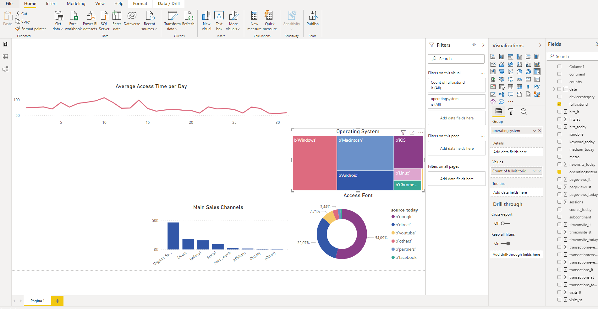
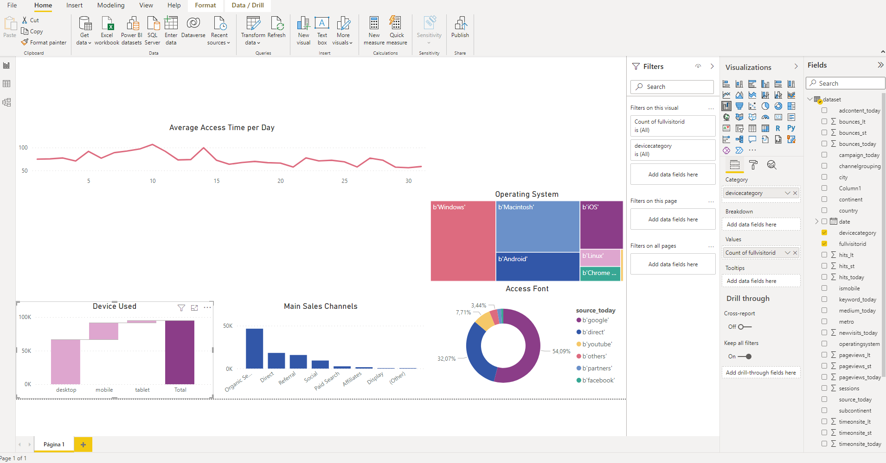
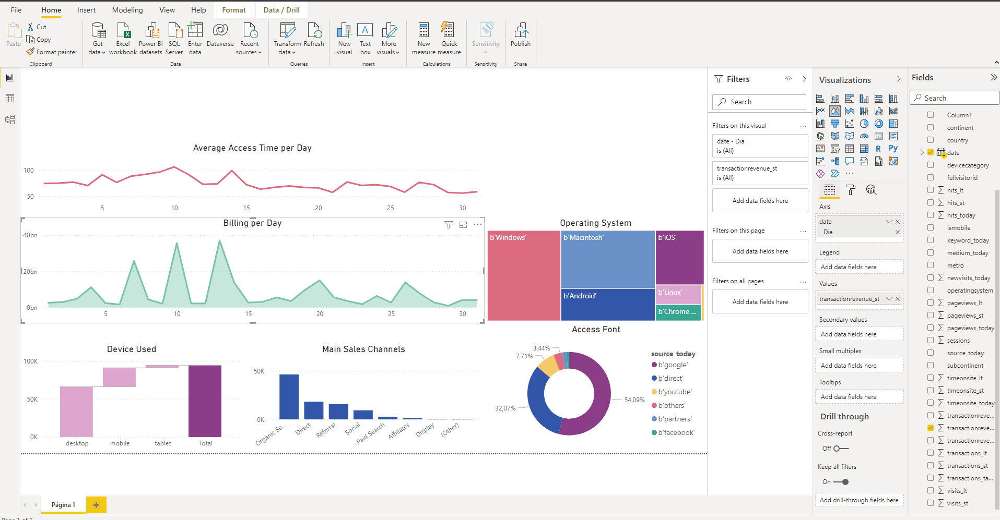
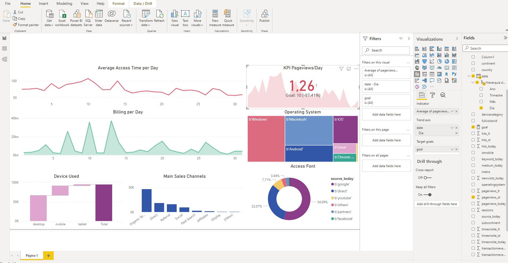
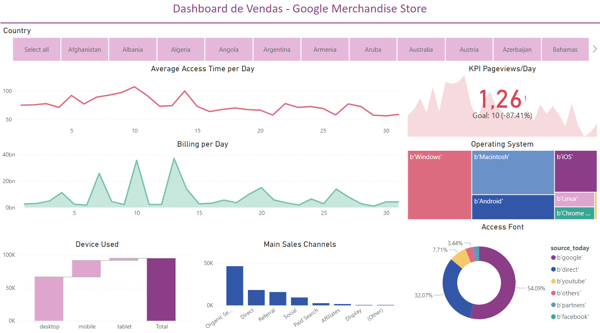

# Mini Project with Power Bi and Google Analytics

The purpose of this mini-project is to simulate what it would be like to work with Power BI using data obtained directly from Google Analytics.

## Getting the data

As many do not have an online page from which to extract the data, we will use data from the [Google Merchandise](https://www.googlemerchandisestore.com/) Store available on [Google Cloud](https://cloud.google.com/). To facilitate analysis, the [dataset](./assets/dataset.csv) used for this project can be downloaded directly from the repository.

## Problem Parameters

We are dealing with data from an e-commerce. For this project, we will answer the following questions:

1. How do customers access our portal the most, through organic or paid search?
2. How long on average does a visitor stay on our portal per day of the month?
3. What is the main source of access to our portal?
4. What is the most used operating system to access our portal?
5. What is the most used device to access our portal?
6. What is the total billing per day?

## Uploading the data and setting the enviroment

If your default language is not English (United States), then you will need to go to `Files` &rarr; `Options & Settings` &rarr; `Options` &rarr; `Regional Settings` and change the language to English (United States). Then, you can click on `Get Data` and import the dataset (CVS file). Before loading the data into your project, click on `Transform Data` to make sure everything is correct.

The first two columns are ID keys, so it's good practice to keep the data as `text`. If Power BI recognized these columns as number, then change the type to `text`. The data doesn't seem to have any other kind of inconsistency, so we can click `Close and Apply`.

For the created dashboard, I chose the `Executive` theme, but feel free to choose the theme that suits you best.

## Answering the questions
### Question 1

To answer this question, we will create a bar chart with the main sales channels. To do this, simply select the bar chart and click on the `fullvisitorid` (count) and `channelgrouping` values.

Thus, we can see that customers access the portal mostly via organic search, while paid search shows one of the lowest returns. This could indicate that there is unnecessary ad spend or that the current ad spend is misdirected.

### Question 2

To answer this question, we will use a line graph. Just select the parameters `day (date - hierarchy)` and `timeonsite_st` (average). Notice that at each step I change the look of the graphs so that they are easier to read.

From this graph, we can see that accesses at the beginning of the month tend to be higher than accesses at the end of the month, reaching their maximum around the 10th. This analysis can help to direct the right moment for promotions and advertisements.

### Question 3

For this question, we can use a donut chart. Just select `fullvisitorid`(count) and `source_today`.

The results show us that the biggest sources of access are Google and direct access. This shows us that any advertising carried out outside of Google has been ineffective in attracting new buyers.

### Question 4

Here I decided to use a treemap. To adjust the graph, I selected `fullvisitorid`(count) and `operatingsystem`.

The results are consistent with expectations: the majority of the population accesses the site using Windows, followed by Macintosh and Android operating systems. If the results showed us a very large percentage of buyers using Linux, for example, this could indicate that we are targeting a more specific niche of the population.

### Question 5

For this answer I used the Waterfall chart, selecting `fullvisitorid`(count) and `devicecategory`.

The results show us a higher percentage of users accessing the site from their desktop. Considering the high number of online purchases that are carried out over the phone today, this could indicate that the site is not being accessed through the more traditional mobile applications (which is corroborated by our access sources graph) or that the user on mobile is not so pleasant. The company could increase its ads on apps like Instagram to reach more mobile audiences or review the site's usability on mobile.

### Question 6

For our last question we are going to use an area chart, selecting the values ​​`day (date - hierarchy)` and `transactionreveneu_st`. With that, we have graphs answering all the questions that were asked of us.

This last analysis allows us to observe that daily revenue follows the trend of the average time spent on the site, being higher at the beginning of the month. This may be related to the day when the majority of the population receives their salary. The two graphs together (revenue and average time) allow us to organize strategies to maximize revenue when we have higher audience engagement and to attract buyers when we have lower engagement.

### Bonus

We will, as a bonus task, analyze the KPI of the number of pageviews per day. For this, we will initially create a goal as a value within our data. Click on `Data` &rarr; `New Measure` and rename your measurement to "meta". Add a value. I decided to select the value of 10 pageviews per day as an average. In real situations these values ​​will already exist, but for exercise purposes we can put a value that we deem reasonable.

So, let's create a KPI chart, selecting the values ​​`day (date - hierarchy)` and `pageviews_st` (average). Under `target goals` select the measure we created.

Finalmente, podemos ver que estamos abaixo da meta estipulada. 

To give the report an extra touch, I'll add a country filter at the top of the page. Thus, in addition to seeing the data globally, it is also possible to analyze each country individually and create customized strategies for each one depending on the results.

## Conclusões

We can see that Google Analytics allows us access to a lot of data from our website. When well analyzed, this data can generate powerful insights that will direct our efforts in terms of product, marketing, sales strategies, among others.

Check out my full Dashboard below:

